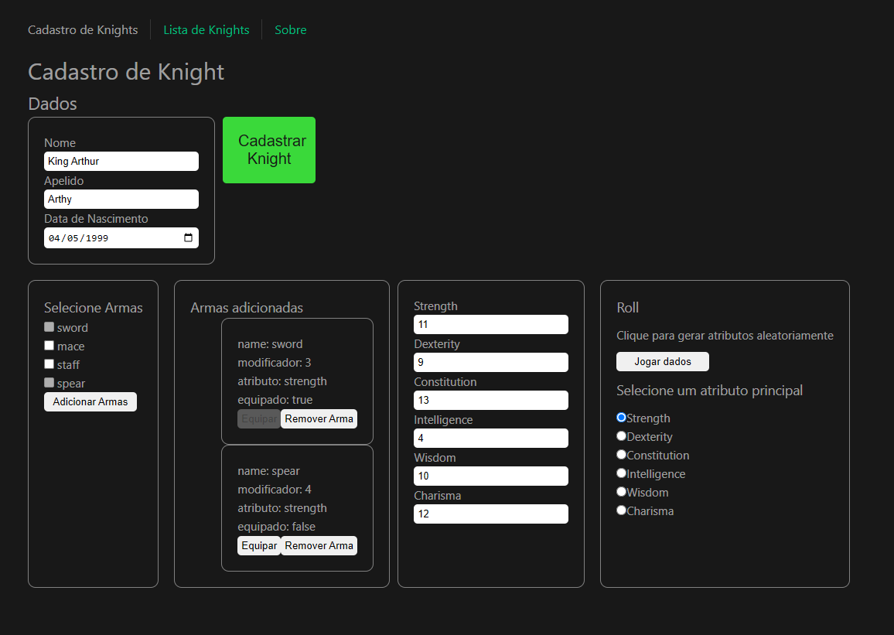
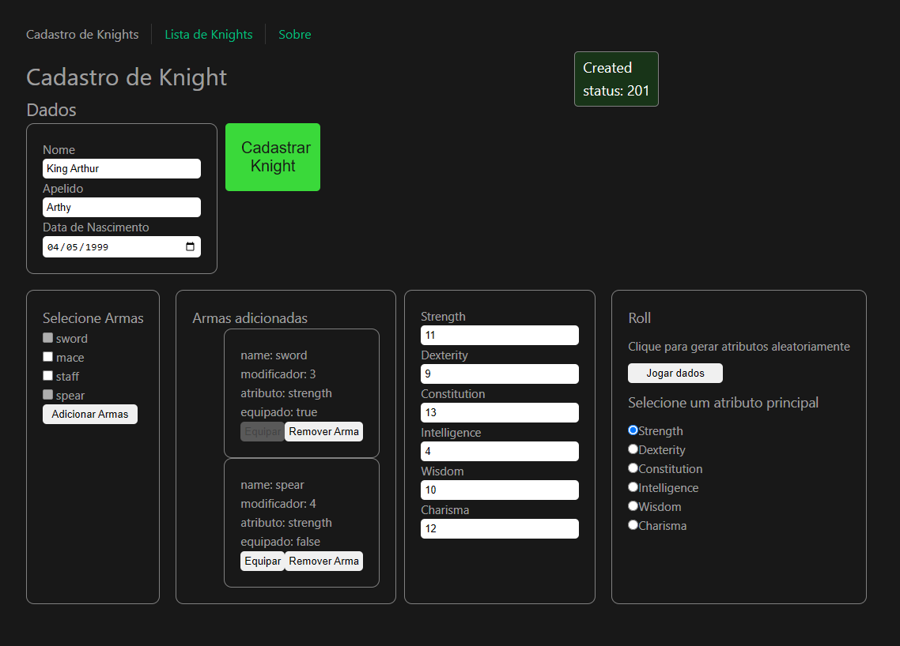
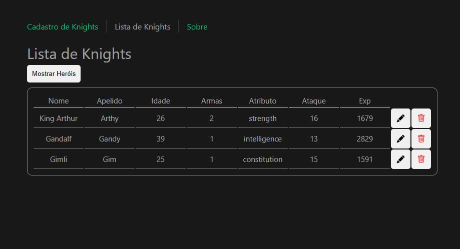
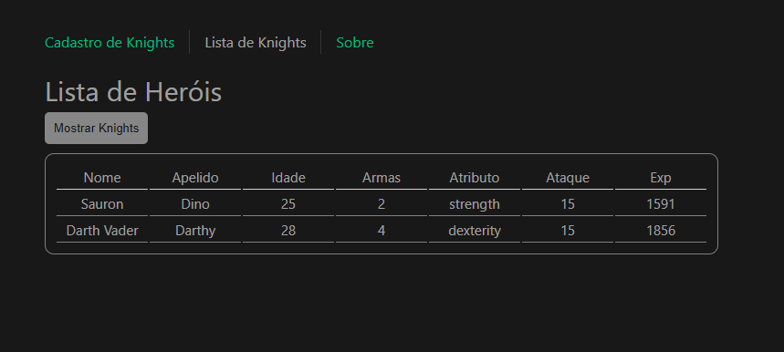

# Knights Challenge - Frontend

[Tecnologias](#tecnologias) | [Funcionalidades](#funcionalidades) | [Descrição](#descrição) | [Instalação](#instalação) | [Avisos](#avisos) | [Imagens](#imagens) | [Suporte](#suporte) | [Lista de bugs](#lista-de-bugs) | [Bugs Resolvidos](#bugs-resolvidos)

## Tecnologias

<ul>
  <li>Vue</li>
  <li>Pinia - Futuramente!</li>
  <li>Oh, Vue Icons!</li>
  <li>Vue Router</li>
</ul>

[Ir para o topo](#knights-challenge---frontend)

## Funcionalidades

- &check; Tela de cadastro de knight
- &check; Lógica para selecionar armas
- &check; Lógica para equipar arma
- &check; Lógica para remover arma 
- &check; Funções geradoras de atributos aleatórios
- &check; Handler para enviar POST request para cadastrar knight no servidor
- &check; Criar estilo simples para component CreateKnight.vue
- &check; Containerizar aplicação
- &check; Configurar servidor para dar suporte ao history mode do Vue Router
- &check; Criar componente ListKnight.vue para exibir lista de todos os knights
- &check; Permitir update de nickname de knight
- &check; Filtro para exibir apenas knights que viram heróis
- &check; Modal para mostrar se mudanças foram bem (ou mal) sucedidas no banco.
- &check; Botão para remover knight
- &check; Filtro para exibir apenas knights que viraram heróis
- &#x2610; Botão para limpar input de criação de knight
- &#x2610; Aplicar os tipos do Typescript em todas as funções e variáveis que faltam
- &#x2610; Refatorar CreateKnight.vue e ListKnight.vue em subcomponentes (WeaponComponent.vue, AttributesComponent.vue, etc.)
- &#x2610; Adicionar validação para POST request. Não permitir que request seja feito sem que todos os dados estejam preenchidos
- &#x2610; Componente para ver os detalhes de um knight
- &#x2610; Implementar testes unitários
- &#x2610; Testes e2e
- &#x2610; Refatorar visual, alinhar botões e divs (e instalar styled-components ou tailwind)
- &#x2610; Não esquecer de testar no mobile após refatoração

[Ir para o topo](#knights-challenge---frontend)

## Descrição

Este se trata do frontend de um desafio de programação que fiz para uma vaga de emprego. Não está completo como podem ver pelas imagens e pela lista de funcionalidades faltando. Mas como desafio em um tempo limitado, acredito que esta bem satisfatório. Não me atentei tanto a deixar o botões perfeitinhos e tudo bem alinhado, ja que esse não era o foco do desafio e o tempo era escasso.

Nesse app é possível criar um knight/cavaleiro, editar seu apelido e remover ele da lista de knights (nesse caso ele vai para a lista de heróis).
Como melhorias mais imediatas colocaria a validação nos inputs para criar o knight. Depois implantaria os testes unitários, que infelizmente não tive tempo de fazer. Só implantei parcialmente no backend. Colocaria um sistema para zerar os inputs após a criação do knight e por último, daria uma repaginada no visual, para ficar tudo alinhado pra ficar mais com uma cara medieval, além de colocar o breakpoints para o mobile.

No mais, além das funcionalidades descritas na lista, já penso em continuar por um tempo colocando coisas legais nesse projeto como um randomizador de personagens, um sistema de combate similar a jogos incrementais tipo CandyBox e um sistema de avanço de níveis. Sugestões serão sempre bem vindas.

**Importante**: Se você der um refresh na rota /list, vai dar erro na página. Ainda não configurei o servidor para dar suporte ao Vue Router. Desculpe pelo inconveniente.


[Ir para o topo](#knights-challenge---frontend)

## Instalação

1. Faça um clone do repositório:
```bash
git clone git@github.com:rushxpush/knights-frontend.git
cd knights-frontend
```

2. Monte a imagem e rode:
```bash
docker compose up --build
```

3. Não esqueça de montar a imagem do backend e rodar. Link: [knights-challenge-backend](https://github.com/rushxpush/knights-backend)


4. Acesse a página em [localhost:8080](http://localhost:8080)

[Ir para o topo](#knights-challenge---frontend)

## Avisos

Futuros avisos

[Ir para o topo](#knights-challenge---frontend)

## Imagens









## Suporte

Qualquer dúvida mande um email para [rafagarciadev@gmail.com](mailto:rafagarciadev@gmail.com)

[Ir para o topo](#knights-challenge---frontend)

## Lista de bugs

- &#x2610; Acessar qualquer link que não seja http://localhost:8080 na barra de navegação gera um erro de página não encontrada (falta configurar o servidor para dar suporte ao Vue Router)

[Ir para o topo](#knights-challenge---frontend)

## Bugs Resolvidos

- &check; Clicar no botão para remover armas da problema. Remover uma arma desequipada desequipa a outra. Caso haja três armas, remover uma arma desequipada, remove as duas desequipadas e desequipa a equipada.

[Ir para o topo](#knights-challenge---frontend)
